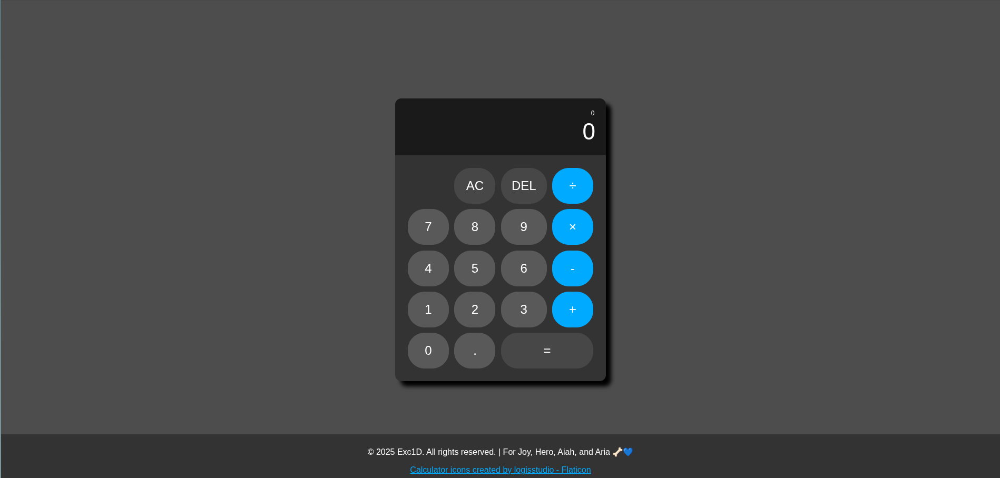

# Odin Calculator

A fully functional, web-based calculator built using vanilla JavaScript, HTML, and CSS. This project was created as part of the curriculum for **The Odin Project**.

No advanced methods used, just pure agony in functions.


## 🚀 Live Demo

[View Live Demo](https://exc1d.github.io/odin-calculator/)


## ✨ Features

- **Basic Arithmetic:** Support for addition, subtraction, multiplication, and division.
- **Keyboard Support:** Fully usable with a keyboard (Numpad or standard row).
  - `0-9`: Input numbers
  - `+ - * /`: Input operators
  - `Enter` or `=`: Calculate result
  - `Backspace`: Delete last digit (DEL)
  - `Escape`: Clear all (AC)
  - `.`: Add decimal point
- **Visual Feedback:** Buttons animate/flash when triggered via keyboard to mimic physical button presses.
- **Accessibility:** Includes `aria-label` attributes for screen reader compatibility.
- **Error Handling:** Prevents division by zero and handles multiple decimal points correctly.

## 🛠️ Technologies Used

- **HTML5:** Semantic markup and structure.
- **CSS3:** Styling with CSS Grid and Flexbox for layout; custom variables for consistent theming.
- **JavaScript (ES6+):** DOM manipulation, event listeners, and logic handling.

## 🧠 Key Learnings

This project focused on strengthening fundamental JavaScript concepts:

1.  **DOM Manipulation:** Selecting elements and updating the display dynamically.
2.  **Event Listeners:** Handling both `click` and `keydown` events efficiently.
3.  **State Management:** Tracking `firstNumber`, `secondNumber`, and `currentOperator` to perform calculations in the correct order.
4.  **Logic Separation:** keeping the calculator logic (`operate`, `add`, etc.) separate from the UI updating functions.

## 💻 Installation & Usage

1.  Clone the repository:
    ```bash
    git clone [https://github.com/Exc1D/odin-calculator.git](https://github.com/Exc1D/odin-calculator.git)
    ```
2.  Navigate to the project directory:
    ```bash
    cd odin-calculator
    ```
3.  Open `index.html` in your preferred web browser.

## 👏 Acknowledgements

- **The Odin Project** for the curriculum and project specifications.
- **Logisstudio** on Flaticon for the calculator icons.
- Dedication: _For Joy, Hero, Aiah, and Aria 🦴💙_

## 📄 License

This project is open source and available under the [MIT License](LICENSE).
